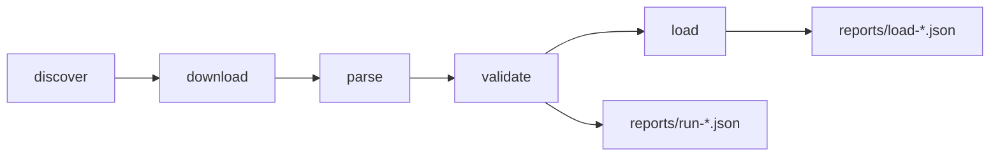

# Data pipeline

Offline, run by an operator or by AG-002, the Data Ingestion Agent
(`docs/06-agents/AG-002-data-ingestion-agent.md`). Code: `packages/pipeline` (TypeScript), shared
types and the seat-type grammar in `packages/core`. Each stage reads the previous stage's files,
so any stage can be re-run on its own. Official cutoff lists are the primary source (ADR-006);
allotment lists add depth and a cross-check.

## Commands (from the repo root)
| Command | Does | Output |
|---|---|---|
| `npm run discover -- 2026` | Reads the home page and the institute-wise allotment page | `data/raw/2026/manifest.json`, `data/raw/2026/html/*.html` |
| `npm run download -- 2026 --colleges 16006,03012 --merit PCMAI` | Cutoff lists + institute list always; allotment PDFs only for `--colleges`; merit lists only for `--merit` | `data/raw/2026/{cutoff,allotment,merit}/…`, `download-log.json` |
| `npm run parse:institutes` | Institute list HTML | `data/processed/2026/institutes.json` |
| `npm run parse:cutoffs` | All official cutoff lists in the manifest | `cutoffs.ndjson`, `cutoff-colleges.json`, `cutoff-parse.json` |
| `npm run parse:allotment` | All downloaded allotment PDFs | `allotment.ndjson`, `allotment-branches.json` |
| `npm run parse:merit` | All India merit list (7,278 pages, ~3 min) | `ai_merit.ndjson`, `ai_merit-check.json` |
| `npm run validate` | Every check below; runs typecheck + tests | `reports/run-<ts>.json`, `data/processed/2026/validation.json` |
| `npm run migrate` | Applies `packages/pipeline/migrations/NNN_*.sql` to **staging** | `schema_migrations` table |
| `npm run load` | Upserts validated data into **staging** | DB rows, `ingest_run` row, `reports/load-<ts>.json` |
| `npm run db:checksum` | Row counts + content hashes per table (idempotency proof) | console |

Layout study: `npx tsx packages/pipeline/src/cli/dumpPage.ts <pdf> <page|all> --raw` prints word
positions with application IDs and names masked (`maskPersonalData`, covered by a unit test).
Parity with the old Python output: `npx tsx packages/pipeline/src/cli/parity.ts allotment|merit <baseline.csv>`.

Downloads: only `fe<year>.mahacet.org` and `cappublicdocs<year>.blob.core.windows.net`, one request
at a time, ≥ 1.1 s apart, cached, `%PDF` header checked. The DB loader connects with
`DATABASE_URL_STAGING` only; production loads are not implemented (operator approval required).

## Source URLs (2026, discovered 2026-09-27)
| Data | URL pattern |
|---|---|
| Official cutoff lists (primary) | `https://cappublicdocs2026.blob.core.windows.net/documents/2026ENGG_CAP<n>_{MH,AI}_CutOff[_V<k>].pdf`, `…_CAP4_Diploma_CutOff.pdf`; Round I MH is `_V1`. Linked from the `fe2026.mahacet.org` home page |
| Allotment list | `https://fe2026.mahacet.org/CAP-<round>/CAPR-<round>_<code>.pdf` (round = I, II, III, IV) |
| College codes | `…/StaticPages/frmInstituteWiseAllotmentList.aspx?did=2021`: 1,548 links = 387 colleges × 4 rounds |
| Institute list | `…/StaticPages/frmInstituteList.aspx?did=1884`: code, name, status, total intake (387 rows) |
| All India (PCM) merit list | `https://cappublicdocs2026.blob.core.windows.net/meritlists/final/FE2026_PCMAI_MeritList_Final.pdf` |
| Other merit lists | PCB/PCM × AI/MH/DEF/JK, provisional and final, listed in the manifest (not parsed) |
| Seat matrix | `…/documents/2026_fe_seatmatrix_V1.pdf` (in the manifest, not parsed) |
| Earlier years | The 2026 home page links 2023–2025 cutoff lists and seat matrices (26 links, recorded in the manifest) |

## Official cutoff list layouts (2026)
**MH lists** (`Cut Off List for Maharashtra & Minority Seats`, landscape): per college
`NNNNN - Name`; per branch `<choice code> - <branch>` (names may wrap), `Status: … Home University
: …`, a section label, a header row of seat-type codes plus `Stage`, then one row per stage with
closing merit numbers and a row of `(percentiles)`.
- Values sit on a regular grid (pitch ≈ 56 pt). Header codes are centred in their cell, values
  left-aligned: a value belongs to the header whose centre is nearest to `x0 + pitch/2`. Cells can be empty.
- Stage labels seen: `I`, `II`, `VII`, `I-Non PWD`, `I-Non Defence`, `MH` (second word may wrap onto the percentile line).
- Sections seen: `State Level`; `Home University Seats Allotted to Home University Candidates`;
  `… to Other Than Home University Candidates`; `Other Than Home University Seats Allotted to …`;
  `Minority Seats Allotted to Maharashtra State Candidature Candidates`;
  `Maharashtra State Seats Allotted to All India Candidature Candidates`.
- Tables wider than the page continue on an untitled page; its header and rows sit at the same y.
- Choice codes can carry suffix letters (`…T` TFWS, `…L`, `…U`, `…K`, e.g. `0303337293LK`).
- Figures are state general merit numbers and MHT-CET percentiles.

**What a round's value means (checked 2026-09-27).** Each round's list gives the closing merit of
the seats **allotted in that round**, not of all seat holders. Seat types with no new allotments
are absent. For example, COEP 16006 has 26–34 MH cells per branch in Round I but only 1–8 in
Round IV. Values can go down between rounds (COEP AI & ML TFWS: 466 in R-I, 372 in R-II). Store
values as published. The rank finder's rule for combining rounds is in
`docs/03-domain/eligibility-rules.md` §6.

**AI lists** (row per record): Sr. No (with thousands separator), All India merit, (percentile),
choice code, institute, course, merit exam (`JEE`, `MHT-CET`, `JEE(Main)-2026`, `MHT-CET-PCB 2026`),
type (`AI to AI`, `MI to AI`, `MH to AI`) and seat type (`AI`, `MI`, or MH codes such as `GNT2H` for
`MH to AI`). Multi-line cells are vertically centred; records are anchored on the choice code.
The same choice code can appear twice with different exams.

**Diploma list** (Round IV only): same row layout, no type or seat-type column, percentages with 2 decimals.

## Allotment PDF layout (2026, COEP + 5 sample colleges)
- Branch header `<choice code> - <branch>`, then `Sanction Intake: N CAP Seats: N [ MS Seats: N
  Minority Seats : N AI Seats: N ] Institute Seats …`. TFWS lists have their own choice code
  ending `1T` (e.g. `1600619111T`, `0600721971UT`) and can start mid-page.
- Sections: `State Level Seats`, Home University / Other Than Home University variants,
  `Minority Seats Allotted to Minority Candidates`, `All India Seats Allotted to … with JEE(Main) Score`,
  `Maharashtra State Seats Allotted to All India Candidature Candidates with MHT-CET Score`, `ORPHAN Seats`.
- Row columns (x, pt): Sr. No ≈ 43 · merit 60–112 · score 100–170 · application ID ≈ 174 · name ≈ 242 ·
  gender 400–440 · category 428–505 (can be several words, e.g. `NT 2 (NT-C)$/DEF2`) · seat type 505–600.
  Rows are anchored on the application ID (±4 pt); the ID and name are never stored.
  When the category runs into the seat-type column the PDF glues them into one word; the parser
  splits off the seat-type suffix.
- `VACANT` rows mark unfilled CAP seats.
- Each list is cumulative: everyone holding a seat after that round.

## All India merit list layout (2026)
7,278 pages, 240,141 candidates. Columns used: merit no (x < 82), merit exam (x 240–310),
percentile / marks (x 295–360). JEE candidates first (merit 1–98,360), then MHT-CET-PCM, then
Diploma and D.Voc. Long names wrap onto a second line (no merit number, ignored).

## Validation checks (`npm run validate`)
| Check | Rule | Blocking |
|---|---|---|
| cutoff-parse | 0 parse issues, contiguous Sr. No, title round = file round, per file | whole load |
| coep-verified-values | 8 operator-verified COEP Round I values match exactly | whole load |
| institute-list | institute list = allotment-list college set (387) | whole load |
| cap-seats | per branch list: candidate rows + `VACANT` rows − EWS rows = printed `CAP Seats` | failing colleges |
| cutoff-cross-check-round-I | Round I official closing merit = max merit in the allotment list, per branch × section × seat type | failing colleges |
| cutoff-cross-check-later-rounds | same for Rounds II–IV using allotments new in the round | informational |
| seat-type-grammar | every seat type parses with `packages/core` (Diploma has none) | failing rows excluded |
| duplicate-cutoff-keys | natural key unique | duplicated keys excluded |
| coverage | every institute has cutoff rows in every round | informational |
| ai-merit-list | ≥ 240,114 rows, JEE 1–98,360 contiguous, scores non-increasing within an exam, no gaps/duplicates, 0 mismatches vs Python | merit load |
| no-personal-data | no `EN########` in any processed file; allotment rows have only allowed fields | whole load |
| typecheck-and-tests | `npm run typecheck`, `vitest run` | whole load |

`ASSUMPTION` (2026-09-27): EWS seats are supernumerary, so EWS rows are excluded from the CAP
Seats sum (confirmed on all 352 sample branch lists, not by an official rule).
`ASSUMPTION`: official Round N lists cover allotments made in Round N, so later-round cross-checks
compare against allotment rows new in that round; residual differences (a few per college) are
reported, not blocking, because the cumulative lists reflect post-reporting status.
`ASSUMPTION`: coverage gaps (a college with no cutoff rows in a round) are reported, not blocking.

## Results of the first run (2026-09-27)
| Output | Count |
|---|---|
| Official cutoff rows (9 lists) | 111,757 (MH 105,053 · AI 6,564 · Diploma 140); loaded 111,754 |
| Colleges / branches in the MH lists | 384 / 2,333 |
| Allotment rows, COEP + 5 samples, 4 rounds | 15,145 (COEP 5,468) |
| All India merit rows | 240,141 of 240,141 |

Python-parity notes: allotment 5,468/5,468 rows; 659 rows differ from the Python output, all from
three Python bugs fixed in TS (TFWS lists filed under the previous branch, multi-word categories
truncated, one glued seat type missed). Merit: 0 mismatches; TS also reads the 27 rows (98,361–98,387)
the Python regex missed.
