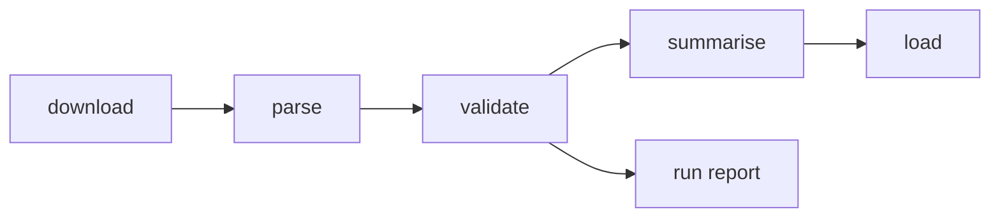

# Data pipeline

Offline, run by an operator. Each stage reads the previous stage's files, so any stage can be
re-run on its own.

## Stages
| Stage | Input | Output | Notes |
|---|---|---|---|
| download | college codes, rounds, year | `data/raw/<year>/allotment/CAPR-<round>_<code>.pdf`, `data/raw/<year>/merit/PCMAI_final.pdf` | Cached; ≥ 1 s between requests; checks the `%PDF` header |
| parse | raw PDFs | `data/processed/allotment_<year>.ndjson`, `ai_merit_<year>.ndjson` | Names and application IDs dropped at read time |
| validate | parsed rows + PDFs | `reports/run-<timestamp>.json` | Per branch: parsed row count vs the printed `CAP Seats: N`; lists every mismatch |
| summarise | parsed rows | cutoff summaries (closing merit, min score, seat count per college × branch × seat type × round × year) | Uses `packages/core` seat-type parsing |
| load | summaries | Postgres cutoff tables | Upsert by natural key; only validated colleges are loaded |

## Source URLs (2026)
The pipeline is operated by AG-002, the Data Ingestion Agent (`docs/06-agents/AG-002-data-ingestion-agent.md`).
Official cutoff lists are the primary source for cutoffs (ADR-006); allotment lists add depth and a cross-check.

| Data | URL pattern |
|---|---|
| Official cutoff lists (primary) | `https://cappublicdocs2026.blob.core.windows.net/documents/2026ENGG_CAP<n>_MH_CutOff[_V1].pdf` (state + minority), `…_CAP<n>_AI_CutOff.pdf` (All India), `…_CAP4_Diploma_CutOff.pdf`. Linked from the `fe2026.mahacet.org` home page |
| Allotment list | `https://fe2026.mahacet.org/CAP-<round>/CAPR-<round>_<code>.pdf` (round = I, II, III, IV) |
| College codes | `https://fe2026.mahacet.org/StaticPages/frmInstituteWiseAllotmentList.aspx` links 1,548 allotment PDFs = 387 colleges × 4 rounds. Codes are 5 digits with leading zeros (e.g. `01002`) |
| Institute list | `https://fe2026.mahacet.org/StaticPages/frmInstituteList.aspx` |
| All India (PCM) merit list | `https://cappublicdocs2026.blob.core.windows.net/meritlists/final/FE2026_PCMAI_MeritList_Final.pdf` |
| State merit list | `UNKNOWN` |

Patterns may change each year; AG-002 re-discovers them from the site before each run.

## Official cutoff list layout (2026, Round I state list, ~4.2 MB)
Per college: `<code> - <name>`, then per branch: `<choice code> - <branch>`, status line, section
(`State Level`, plus Home University / Other than HU / Minority where present), a row of seat-type
codes, the `Stage` (round) row of closing merit numbers, and a row of percentiles in brackets.
Figures are the state general merit number (All India list: All India merit).
Verified: COEP Round I values equal those computed from COEP allotment lists (Civil GOPENS 4,148;
GSCS 13,137; GOBCS 5,736; TFWS 3,746; AI & ML GOPENS 365, EWS 1,261; Instrumentation GOPENS 1,743).

## Allotment PDF layout (observed on COEP, 2026)
- Each branch starts with a header: choice code and name, then `Sanction Intake`, `CAP Seats`,
  `MS Seats`, `AI Seats`.
- Sections: `State Level Seats`, `All India Seats …`. Other colleges also have Home University,
  Other than Home University, Minority and Institute sections (to verify in Phase 4).
- Row columns (x in PDF points, top-origin): Sr. No ≈ 46 · merit ≈ 76 · score ≈ 115 ·
  application ID ≈ 174 · name ≈ 242 · gender ≈ 416 · category ≈ 457 · seat type ≈ 513.
  Phase 4 replaces fixed positions with detection from each page's header row.
- Separate lists for TFWS (`…T` choice code) and EWS (`[EWS]`).
- Each list is cumulative: it shows everyone holding a seat after that round.

## All India merit list layout (2026)
7,278 pages, 240,141 candidates. Columns: merit no, application ID, name, merit exam, percentile,
subject percentiles, HSC and SSC marks. JEE candidates ranked first (merit 1–98,360), then
MHT-CET-only, then diploma candidates. Long names wrap onto a second line.

## Known parser results (Python baseline, used for the TypeScript parity check)
| Output | Count |
|---|---|
| COEP 2026 allotment rows (4 rounds) | 5,468 (1 with missing seat type) |
| All India merit rows | 240,114 of 240,141 |
| COEP All India rows matching the merit list | 948 of 948 |
