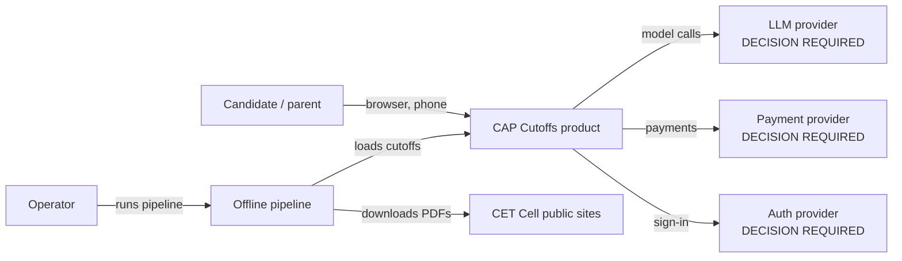
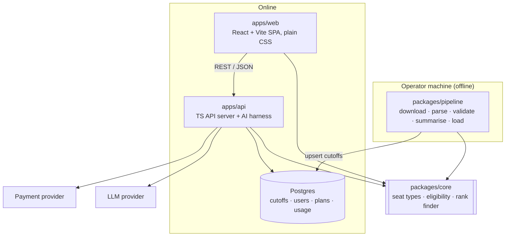
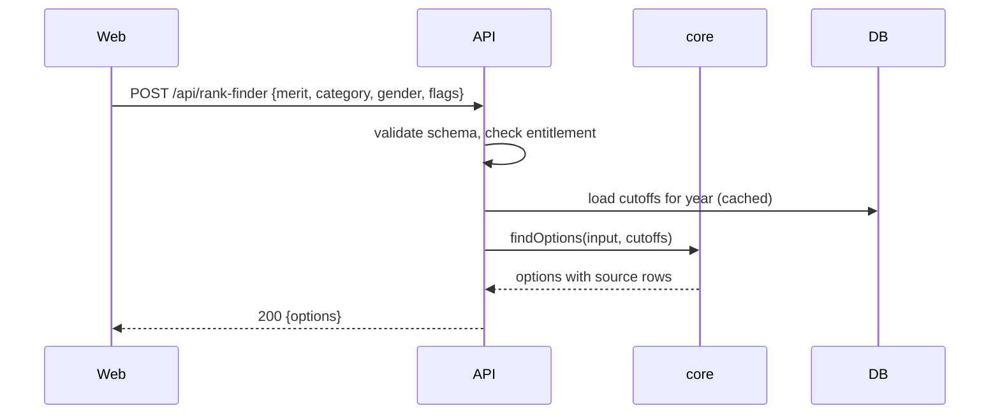
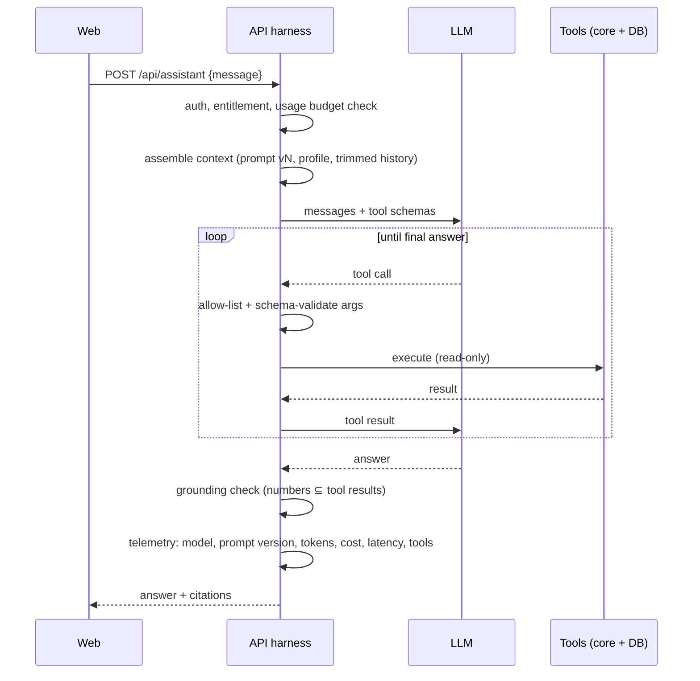
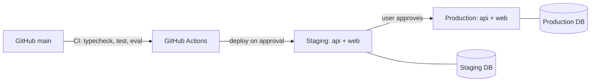

# System architecture

Status: target design (ADR-002, ADR-005). Only `src/pdf.ts` exists in TypeScript today.

## System context

## Containers

## Components
| Component | Responsibility | Notes |
|---|---|---|
| `packages/core` | Seat-type parsing, eligibility rules, rank-finder matching, percentile→rank lookup | Pure functions, no I/O. The only place admissions logic lives. |
| `packages/pipeline` | CLI stages; writes a run report | See `data-pipeline.md` |
| `apps/api` | Auth middleware, entitlement checks, REST routes, AI harness and tools, payment webhooks, usage metering | Framework `DECISION REQUIRED` (Hono recommended) |
| `apps/web` | Pages: rank finder, college, compare, assistant chat, account/billing | Plain CSS with design tokens; data through `src/lib/api.ts` |
| Postgres | Cutoff tables (read-mostly), users, subscriptions, usage | Supabase recommended, `DECISION REQUIRED` |

## Request flow: rank finder

## AI request flow

## Deployment

Hosting: Railway, web and API as two services per environment (#118). Details in `09-devops/`.

## Observability
Structured logs with request IDs from the API; AI telemetry per call; pipeline run reports.
See `10-observability/logging-metrics.md`.
