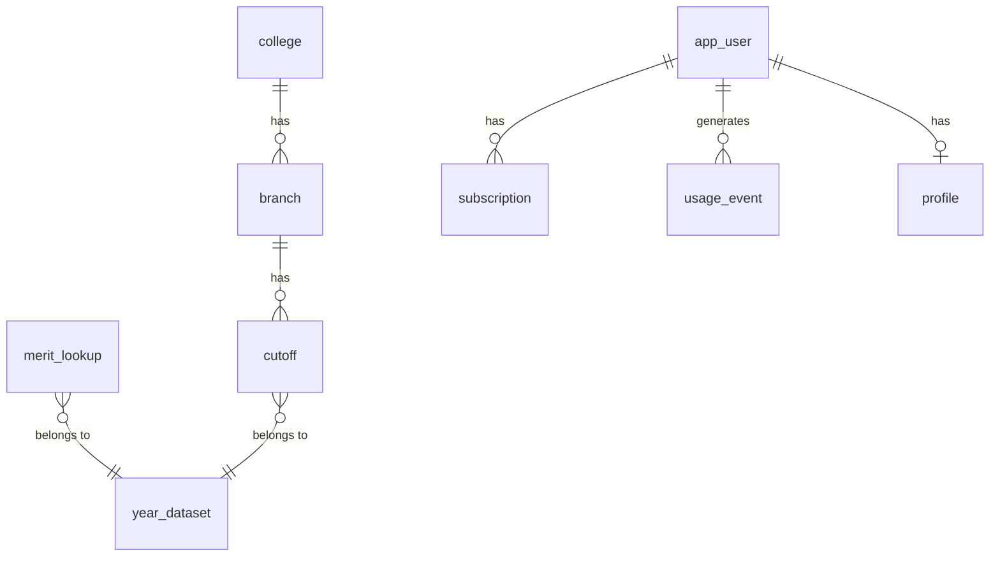

# Data model

## Pipeline records (local, git-ignored)

### AllotmentRow — one seat holder in one round
| Field | Type | Example | Notes |
|---|---|---|---|
| year | number | 2026 | |
| round | `I`\|`II`\|`III`\|`IV`… | `IV` | |
| collegeCode | string | `16006` | |
| choiceCode | string | `1600624210` | may end in `T`; EWS lists marked `[EWS]` |
| branch | string | `Computer Science and Engineering` | as printed |
| section | string | `State Level Seats` | |
| merit | number | 555 | state or All India merit no, depending on section |
| score | number | 99.8737180 | MHT-CET or JEE percentile |
| gender | `M`\|`F` | `F` | |
| category | string | `OBC` | raw, incl. markers like `$`, `/DEF` |
| seatType | string | `GOPENS` | |

No name and no application ID (ADR-003).

### MeritRow — All India merit list
| Field | Type | Example |
|---|---|---|
| year | number | 2026 |
| merit | number | 1 |
| exam | `JEE`\|`MHT-CET-PCM`\|`Diploma`\|`D.Voc.` | `JEE` |
| score | number | 99.9917594 |

## Database (target, Postgres)
`ASSUMPTION`: final column types are set in Phase 6. Existing columns are never modified; new
columns get defaults; every change has a migration.

| Table | Key columns |
|---|---|
| `year_dataset` | year (PK), loaded_at, run_report_id |
| `college` | code (PK), name, district, university, status (autonomous etc.) |
| `branch` | choice_code (PK), college_code (FK), name, list_type (`regular`\|`tfws`\|`ews`) |
| `cutoff` | (year, choice_code, section, seat_type, round) (PK), closing_merit, opening_merit, min_score, seats_filled |
| `merit_lookup` | (year, list, merit) (PK), exam, score. Sampled or full; used for percentile→rank |
| `app_user` | id (PK), auth_provider_id, created_at |
| `profile` | user_id (PK/FK), merit, jee_percentile, category, gender, flags (json). Personal data |
| `subscription` | id (PK), user_id (FK), plan, status, period_start, period_end, provider_ref |
| `usage_event` | id (PK), user_id (FK), kind, model, prompt_version, input_tokens, output_tokens, cost, created_at |

Audit fields `created_at` / `updated_at` on user tables. Soft delete: `DECISION REQUIRED` (DPDP
erasure requests may require hard delete of `profile`). Retention: `DECISION REQUIRED`.
