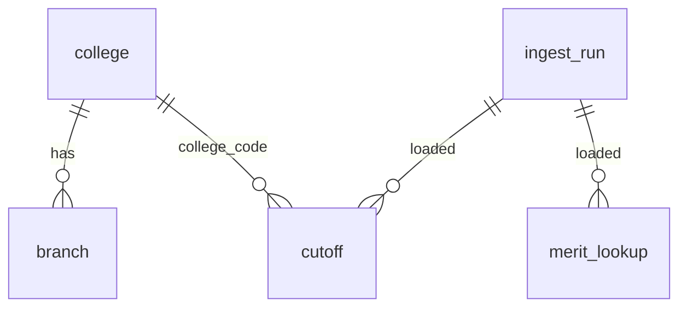

# Data model

Types live in `packages/core/src/types.ts`; the database schema in
`packages/pipeline/migrations/`. Every table and type carries `authority` (admission body) and,
where relevant, `exam`, so other states can be added later without changing keys.
`ASSUMPTION` (operator decision 2026-09-27): the only authority is `MH-CET-CELL`
(State CET Cell, Maharashtra). Per-authority rules are registered in
`packages/core/src/authority.ts` (seat-type grammar now; eligibility rules later).

## Pipeline records (local, git-ignored, `data/processed/<year>/`)

### CutoffRow — one cell of an official cutoff list (`cutoffs.ndjson`)
| Field | Type | Example | Notes |
|---|---|---|---|
| authority | string | `MH-CET-CELL` | |
| exam | string | `MHT-CET` | MH lists: `MHT-CET`. AI / Diploma lists: merit exam as printed (`JEE`, `JEE(Main)-2026`, `MHT-CET`, `MHT-CET-PCB 2026`, `Diploma/ D.voc`) |
| year | number | 2026 | |
| list | `MH`\|`AI`\|`Diploma` | `MH` | which official list |
| round | `I`…`IV` | `I` | from the file name, checked against the title |
| collegeCode | string | `16006` | |
| choiceCode | string | `1600619110` | |
| section | string | `State Level` | MH: printed section; AI: printed type (`AI to AI`, `MH to AI`, `MI to AI`); Diploma: `Diploma` |
| seatType | string | `GOPENS` | empty for the Diploma list (none printed; `ASSUMPTION`, operator decision) |
| stage | string | `I` | MH stage label (`I`, `II`, `VII`, `I-Non PWD`, `I-Non Defence`, `MH`); empty for AI / Diploma |
| closingMerit | number | 4148 | MH: state general merit; AI / Diploma: All India merit |
| closingPercentile | number | 99.0434195 | as printed in brackets |
| sourceFile, sourcePage | string, number | | provenance |

Natural key: (authority, exam, year, list, round, choiceCode, section, seatType, stage)
(`ASSUMPTION`, operator decision 2026-09-27: stage and exam are needed because a branch and seat type
can have several values per round).

### AllotmentRow — one seat holder in one allotment list (`allotment.ndjson`)
| Field | Type | Example | Notes |
|---|---|---|---|
| year, round, collegeCode | | 2026, `IV`, `16006` | |
| choiceCode | string | `1600624210` | TFWS lists end `1T` (`1600619111T`) |
| branch | string | `Computer Science and Engineering` | as printed |
| section | string | `State Level Seats` | as printed |
| merit | number | 555 | state or All India merit no, depending on section |
| score | number | 99.8737180 | MHT-CET or JEE percentile |
| gender | `M`\|`F`\|`T` | `F` | |
| category | string | `NT 2 (NT-C)$/DEF2` | raw, incl. markers like `$`, `#`, `/DEF`, `/PH1` |
| seatType | string | `GOPENS` | |

No name and no application ID (ADR-003). Branch-level counts (`AllotmentBranch`): sanction intake,
CAP / MS / minority / AI seats, parsed rows and `VACANT` rows per seat type.

### MeritRow — All India merit list (`ai_merit.ndjson`)
| Field | Type | Example |
|---|---|---|
| merit | number | 1 |
| exam | `JEE`\|`MHT-CET-PCM`\|`Diploma`\|`D.Voc.` | `JEE` |
| score | number | 99.9917594 |

## Database (Postgres on Supabase; built by `001_initial_schema.sql`)
Existing columns are never modified; new columns get defaults; every change has a migration.

| Table | Key | Other columns |
|---|---|---|
| `ingest_run` | id (timestamp) | kind, year, git_commit, started_at, finished_at, status, summary (jsonb, counts only) |
| `college` | (authority, code) | exam, name, status (institute list), home_university (cutoff-list Status line, most common value), total_intake, run_id, updated_at |
| `branch` | (authority, choice_code) | college_code (FK → college), exam, name, status, run_id, updated_at |
| `cutoff` | (authority, exam, year, list, round, choice_code, section, seat_type, stage) | college_code, closing_merit, closing_percentile, source (file), source_page, run_id, updated_at |
| `merit_lookup` | (authority, year, list, merit) | exam, score, run_id. `list` = `PCMAI` for the All India PCM list |
| `schema_migrations` | name | applied_at (written by `npm run migrate`) |

`cutoff` has no foreign key to `branch`: AI and Diploma list choice codes are not all printed in the
MH lists. The loader keeps `college_code` consistent with `college`.

Not built yet (target, Phase 6): `opening_merit` / `seats_filled` on cutoffs (from allotment lists),
`app_user`, `profile`, `subscription`, `usage_event`:

| Table | Key columns |
|---|---|
| `app_user` | id (PK), auth_provider_id, created_at |
| `profile` | user_id (PK/FK), merit, jee_percentile, category, gender, flags (json). Personal data |
| `subscription` | id (PK), user_id (FK), plan, status, period_start, period_end, provider_ref |
| `usage_event` | id (PK), user_id (FK), kind, model, prompt_version, input_tokens, output_tokens, cost, created_at |

Audit fields `created_at` / `updated_at` on user tables. Soft delete: `DECISION REQUIRED` (DPDP
erasure requests may require hard delete of `profile`). Retention: `DECISION REQUIRED`.
